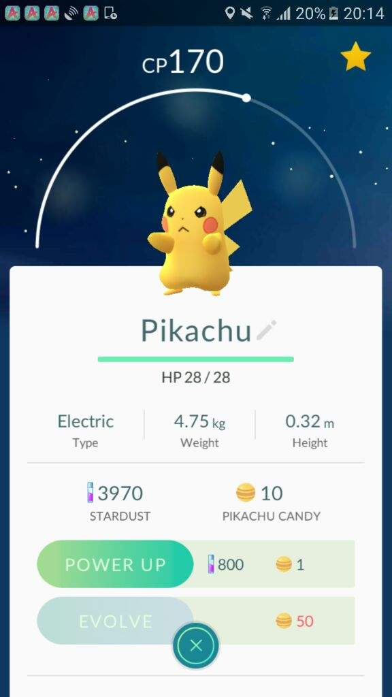

Primero empezaremos estructurando nuestro directorio:
├───css/
│   ├───burger-menu-icon.css
│   └───main.css
├───images/
│   ├───Quagsire2_original_original.jpg
│   ├───fb24a57d5d82b2fa23c3c3878091530d.jpg
│   ├───gam1282.cur
│   ├───pokeball-icon.png
│   ├───pokeball.png
│   ├───pokemon-bg.jpg
│   ├───pokemon-go.jpg
│   ├───pokemon_logo.png
│   ├───search.png
│   └───thunder.png

Las imagenes podréis encontrarlas en el repo


├───scripts/
│   ├───Database.js
│   ├───Login.js
│   ├───Signup.js
│   ├───User.js
│   ├───Validator.js
│   └───pokeApiService.js
├───.gitignore
├───dashboard.html
├───index.html
├───login.html
└───signup.html

Os damos los html hechos para que pasemos a la parte importante:

## dashboard.html
```html

<!DOCTYPE html>
<html lang="es">

<head>
  <meta charset="UTF-8">
  <title>Pokémon - Dashboard</title>
  <link href="https://fonts.googleapis.com/css?family=Open+Sans:300,600" rel="stylesheet">
  <meta name="viewport" content="width=device-width, initial-scale=1, shrink-to-fit=no">
  <link rel="stylesheet" href="css/main.css">
  <link rel="stylesheet" href="css/burger-menu-icon.css">
</head>

<body>
  <header>
    <nav>
      <div class="nav-container">
        <a href="index.html"></a>
        <div>
          <div class="burger-menu-icon" >
            <span></span>
            <span></span>
            <span></span>
            <span></span>
          </div>
        </div>
      </div>
      <ul class="nav-menu hide-menu" id="nav-menu">
        <li><a href="dashboard.html" class="selected">Dashboard</a></li>
        <li><a href="signup.html">Sign Up</a></li>
        <li><a href="login.html">Login</a></li>
      </ul>
    </nav>
    <section class="header-section header-pokedex">
      <div class="header-bg"></div>
      <div class="header-text">
        <h1>Pokédex</h1>
        <p>Lorem ipsum dolor sit amet consectetur adipisicing elit.<br></p>
      </div>
    </section>
  </header>
  <main>

    <div class="container">
      <section class="pokemon-list">
      </section>
    </div>

  </main>
  <script src="scripts/pokeApiService.js"></script>
</body>

</html>

```

## index.html

```html
<!DOCTYPE html>
<html lang="es">

<head>
  <meta charset="UTF-8">
  <title>Pokémon</title>
  <link href="https://fonts.googleapis.com/css?family=Open+Sans:300,600" rel="stylesheet">
  <meta name="viewport" content="width=device-width, initial-scale=1, shrink-to-fit=no">
  <link rel="stylesheet" href="css/main.css">
  <link rel="stylesheet" href="css/burger-menu-icon.css">
</head>

<body>
  <header>
    
    <nav> <!-- BARRA DE NAVEGACIÓN -->
      <div class="nav-container">
        <!-- EL BOTÓN DE INICIO -->
        <a href="index.html"></a>
        <div>
          <div class="burger-menu-icon" >
            <span></span>
            <span></span>
            <span></span>
            <span></span>
          </div>
        </div>
      </div>
      <ul class="nav-menu hide-menu" id="nav-menu">
        <!-- LOS BOTONES DE NAVEGACIÓN -->
        <li><a href="dashboard.html">Dashboard</a></li>
        <li><a href="signup.html">Sign Up</a></li>
        <li><a href="login.html">Login</a></li>
      </ul>
    </nav>

    <section class="header-section">
      <div class="header-bg"></div>
      <div class="header-text">
        <h1>Pokémon</h1>
        <p>Lorem ipsum dolor sit amet consectetur adipisicing elit.<br></p>
      </div>
    </section>
  </header>

  <main>

    <section class="app-info">
      <div class="app-description">

        <h2>Pokémon GO</h2>

        <article>
          <h4>Lorem Ipsum</h4>
          <p>Lorem ipsum dolor sit amet consectetur adipisicing elit.</p>
        </article>

        <article>
          <h4>Lorem Ipsum</h4>
          <p>Lorem ipsum dolor sit amet consectetur adipisicing elit.</p>
        </article>

        <article>
          <h4>Lorem Ipsum</h4>
          <p>Lorem ipsum dolor sit amet consectetur adipisicing elit.</p>
        </article>

      </div>

      <div class="app-icon">
        
      </div>

      <div class="app-image">
        
      </div>

    </section>
  </main>
</body>

</html>

```

## login.html

``` html

<!DOCTYPE html>
<html lang="es">

<head>
  <meta charset="UTF-8">
  <title>Pokémon - Login</title>
  <link href="https://fonts.googleapis.com/css?family=Open+Sans:300,600" rel="stylesheet">
  <meta name="viewport" content="width=device-width, initial-scale=1, shrink-to-fit=no">
  <link rel="stylesheet" href="css/main.css">
  <link rel="stylesheet" href="css/burger-menu-icon.css">
</head>

<body>
  <header>
    <nav>
      <div class="nav-container">
        <a href="index.html"></a>
        <div>
          <div class="burger-menu-icon" >
            <span></span>
            <span></span>
            <span></span>
            <span></span>
          </div>
        </div>
      </div>
      <ul class="nav-menu hide-menu" id="nav-menu">
        <li><a href="dashboard.html">Dashboard</a></li>
        <li><a href="signup.html">Sign Up</a></li>
        <li><a href="login.html" class="selected">Login</a></li>
      </ul>
    </nav>
  </header>

  <main>
    <section class="login">
      <h2>Login</h2>
      <div class="form-wrapper">
        <form class="login-form" action="">
          <input type="email" id="email" placeholder="Email" />
          <input type="password" id="password" placeholder="****" />
          <button type="submit" class="button" id="login-button">Login</button>
        </form>
        <div class="message-container">
        </div>
      </div>
    </section>
  </main>
  <script src="scripts/Login.js"></script>
  <script src="scripts/Database.js"></script>
</body>

</html>
```

## signup.html

```html
<!DOCTYPE html>
<html lang="es">

<head>
  <meta charset="UTF-8">
  <title>Pokémon - Signup</title>
  <link href="https://fonts.googleapis.com/css?family=Open+Sans:300,600" rel="stylesheet">
  <meta name="viewport" content="width=device-width, initial-scale=1, shrink-to-fit=no">
  <link rel="stylesheet" href="css/main.css">
  <link rel="stylesheet" href="css/burger-menu-icon.css">
</head>

<body>
  <header>
    <nav>
      <div class="nav-container">
        <a href="index.html"></a>
        <div>
          <div class="burger-menu-icon" >
            <span></span>
            <span></span>
            <span></span>
            <span></span>
          </div>
        </div>
      </div>
      <ul class="nav-menu hide-menu" id="nav-menu">
        <li><a href="dashboard.html">Dashboard</a></li>
        <li><a href="signup.html" class="selected">Sign Up</a></li>
        <li><a href="login.html">Login</a></li>
      </ul>
    </nav>
  </header>

  <main>
    <section class="signup">
      <h2>Sign Up</h2>
      <div class="form-wrapper">
        <form class="signup-form" action="">
          <input type="text" id="name" placeholder="Name" />
          <input type="text" id="pokemon" placeholder="Pokémon favorito" />
          <input type="text" id="type" placeholder="Tipo favorito" />

          <!-- hacemos el input email type text para que no moleste la validación -->
          <input type="text" id="email" placeholder="Email" />
          <input type="password" id="password" placeholder="****" />
          <input type="password" id="repeat-password" placeholder="****" />
          
          <!-- El atríbuto `disabled` desactiva el botón. El botón será activado o desactivado por el método `checkButton` en Signup.js -->
          <button type="submit" class="button" id="signup-button" disabled >Sign Up</button>
        </form>
        <div class="message-container">
        </div>
      </div>
    </section>
  </main>

  <script src="scripts/Signup.js"></script>
  <script src="scripts/User.js"></script>
  <script src="scripts/Database.js"></script>
  <script src="scripts/Validator.js"></script>
</body>

</html>

```

Así como el .gitignore =>

.vscode
.DS_Store


Empezaremos por la llamada a la API de Pokemon =>

##### scripts/pokeApiServicejs

```js
'use strict';

function getPokemons () {

  const section = document.querySelector(".pokemon-list");


  for (let i = 0; i < 21; i++) {
    // cada pokemon lleva su propio indice
    // tenemos que añadir el indice al fin de URL de la API
    fetch(`https://pokeapi.co/api/v2/pokemon/${i + 1}`)
      .then((response) => {
        // convertiremos la respuesta a un objeto legible, porque los datos de la respuesta (response.body) están codificados

        return response.json(); // response.json() es tambien una operacion asincrona
      })
      .then((data) => {
        
        const article = document.createElement('article');
        article.innerHTML = `
          
          <h3>${data.name}</h3>
        `;

        section.appendChild(article);
      })
      .catch((err) => {})
  }
}

async function getPokemonsAA () {
  const section = document.querySelector(".pokemon-list");

  for (let i = 0; i < 21; i++) {
    try {
      const response = await fetch(`https://pokeapi.co/api/v2/pokemon/${i + 1}`);
      const data = await response.json();
  
        //Hacemos la llamada a la API y creamos un elemento por cada Pokemon que nos trae de la API.

      const article = document.createElement('article');
      article.innerHTML = `
        
        <h3>${data.name}</h3>
      `;
  
      section.appendChild(article);
    } catch (err) {
      
    }
  }
}

//Por último invocamos a la función para llamar a la API

getPokemonsAA();

```

## scripts/Database.js

```js

'use strict' //Usamos use strict

class Database {
  // recuperar los usuarios - el array
  getAllUsers = () => {
    // recuperar el string
    const usersStr = localStorage.getItem("users");
    // convierte el string en un array
    const usersArr = JSON.parse( usersStr );

    // si todavia no hay usuarios, devuelve un array vacio
    if (usersArr === null) {
      return [];
    } else {
      return usersArr;
    }
    
  }

  //Guardamos el usuario con la siguiente función:

  saveNewUser = (newUser) => {

    // Recuperamos el array de los usuarios del localStorage
    const usersArr = this.getAllUsers();

    // Actualizamos el array de usuarios
    usersArr.push(newUser);

    // Convertimos el array a un string
    const usersStr = JSON.stringify(usersArr);

    // Y por último almacenamos de nuevo
    localStorage.setItem("users", usersStr);
  }
}

//Creamos un objeto nuevo de Databse con new y lo almacenamos en db

const db = new Database();

console.log('db', db)


```


## User.js

```js

'use strict'; //Usamos use strict


    //Creamos una clase
class User {
    //Y a continuación haremos un constructor con los datos que recibirá el usuario y los almacenamos
  constructor(name, pokemon, type, email, password) {
    this.name = name;
    this.pokemon = pokemon;
    this.type = type;
    this.email = email;
    this.password = password;
  }
  
}

```

## scripts/Validator.js

```js

'use strict'; //Usamos use strict


class Validator {
  constructor() {
    // Creamos los mensajes que queremos que aparezcan de forma predeterminada
    this.invalidEmailError = 'Intorduce un email válido';
    this.emailExistsError = 'Este email ya está registrado';
    this.passwordError = 'Introduce una contraseña de 6 o más carácteres';
    this.repeatPasswordError = 'Los campos no coinciden';

    // Creamos un objeto con los errores que vamos a mostrar al usuario
    this.errors = {
      invalidEmailError: this.invalidEmailError,
      passwordError: this.passwordError,
      repeatPasswordError: this.repeatPasswordError
    }
  }

    // Validamos el nombre del email
    validateValidEmail = (email) => {
      // Y creamos una regla, si el email es valido, quita el mensaje de error
      if (this.emailIsValid(email)) {
        delete this.errors.invalidEmailError;
      }
      else {
        // Pero si el email no es valido, aparecerá un mensaje de error
        this.errors.invalidEmailError = this.invalidEmailError;
      }
    }

    // Creamos una función auxiliar de `validateEmail`
    emailIsValid = (email) => {
      // Usamos RegEx objeto special - para que valide que sea un email
      const emailRegEx = /^\w+([\.-]?\w+)*@\w+([\.-]?\w+)*(\.\w{2,4})+$/;
      
      // Esto devuelve un true o un false, por lo que si es correcto el email podrá ser registrado
      const isValid = emailRegEx.test(email);
      
      return isValid;      
    }
    
    // Validamos que el email no esta tomado (es unico)
    validateUniqueEmail = (newEmail) => {

        //Obtenemos todos los usuarios
      const usersDB = db.getAllUsers();

        //Y como el email es único, creamos una variable para que esté en true
      let emailUnique = true;

//Comprobamos que el email es único, si lo es pasa la validaciónm, si no, cambiamos emailUnique a false
      if(usersDB.length > 0) {
        usersDB.forEach( (userObj) => {
          // si el email ya esta tomado, cambia el valior de la variable a `false`
          if (userObj.email === newEmail ) {
            emailUnique = false;
          }
        })

            //Si el email es unico, osea, que es true
        if (emailUnique) {
          // Quitamos el mensaje de error
          delete this.errors.emailExistsError;
        } else {
          // Pero si el email no es unico, aparecerá el mensaje de nuevo
          this.errors.emailExistsError = this.emailExistsError
        }

      }
    }

    // Validamos la longitud del password
    validatePassword = (password) => {
      if (password.length > 5) {
        // Si pasa esta regla, quitamos el mensaje de error
        delete this.errors.passwordError;
      }
      else {
        // En cambio, si el password tiene menos de 5 caracteres, agregamos el mensaje
        this.errors.passwordError = this.passwordError;
      }
    }

    // Validamos si el password y el repeat-password coinciden
    validatePasswordRepeat = (password, passwordRepeat) => {
      if (password === passwordRepeat) {
        // Si los 2 passwords coinciden, quita el error
        delete this.errors.repeatPasswordError;
      }
      else {
        // En cambio, si no coinciden, agregamos el mensaje
        this.errors.repeatPasswordError = this.repeatPasswordError;
      }
    }

    // Obtenemos el objeto con errors, para mostrarlos al usuario en la pagina Signup
    getErrors = () => {
      return this.errors;
    }

    // Y por último reiniciamos los errores mostrados, para el proximo Signup
    resetValidator = () => {
      this.errors = {
        invalidEmailError: this.invalidEmailError,
        passwordError: this.passwordError,
        repeatPasswordError: this.repeatPasswordError
      }
    }
}

const validator = new Validator();

```


## Signup.js

```js

'use strict'; //Usamos use strict

//Creamos una clase
class Signup {
  constructor () {
      //Y echando un ojo a donde tenemos los input del signup, seleccionamos todos los id's o class que poseen los inputs para poder seleccionarlos con querySelector
    this.nameInput = document.querySelector("#name");
    this.pokemonInput = document.querySelector("#pokemon");
    this.typeInput = document.querySelector("#type");
    this.emailInput = document.querySelector("#email");
    this.passwordInput = document.querySelector("#password");
    this.repeatPasswordInput = document.querySelector("#repeat-password");

    this.buttonInput = document.querySelector("#signup-button");
    this.errorsWrapper = document.querySelector(".message-container");

  }


  // Gestionamos cambios del input "email"
  handleEmailInput = (event) => {
    const email = event.target.value;

    // Validamos el texto del input email
    validator.validateValidEmail(email);

//Lo almacenamos en una variable
    const errors = validator.getErrors();

    // Y creamos la regla de que si el nombre del email es valido o dicho otra manera, si el email no exite:
    if (!errors.invalidEmailError) {
      // comprueba si el email es unico
      validator.validateUniqueEmail(email);
    }

    //Si existe enviaremos ese error a :

    this.setErrorMessages();

    // Después comprobamos si hay errores, si no hay errores activa el boton Sign up (disabled = false)
    this.checkButton();
  }

  // Gestionamso cambios del input "password"
  handlePasswordInput = (event) => {
    const password = event.target.value;
    const passwordRepeat = this.repeatPasswordInput.value;


    // Validamos el texto del input password
    validator.validatePassword(password);
    validator.validatePasswordRepeat(password, passwordRepeat);

    this.setErrorMessages();

    // Comprobamos si hay errores, si no hay errores activa el boton Sign up (disabled = false)
    this.checkButton();
  }

  // Gestionamos cambios del input "repeat-password"
  handleRepeatPasswordInput = (event) => {
    const passwordRepeat = event.target.value;
    const password = this.passwordInput.value;

    // Validamos el texto del input password y validamos el texto del input repeatPassword
    
    validator.validatePassword(password);
    validator.validatePasswordRepeat(password, passwordRepeat);

    this.setErrorMessages();

    // Comprobamos si hay errores, si no hay errores activa el boton Sign up (disabled = false)
    this.checkButton();
  }

  // Gestionamos el envio de los datos (submit)
  saveData = (event) => {
    // Ahora usamos event.preventDefault para cuando el event ocurra, que se cancele y no recargue la página ya que el submit en principio refresca la página
    event.preventDefault();
    // Recogemos los valores de cada input
    const name = this.nameInput.value;
    const pokemon = this.pokemonInput.value;
    const type = this.typeInput.value;
    const email = this.emailInput.value;
    const password = this.passwordInput.value;
    const repeatPassword = this.repeatPasswordInput.value;

    //Creamos una variable que almacene una copia de nuestro signup

    const newUser = new User(name, pokemon, type, email, password);

    // Y por último guardamos el usuario en nuestra base de datos
    db.saveNewUser( newUser );


    // Vaciamos el form
    this.nameInput.value = "";
    this.pokemonInput.value = "";
    this.typeInput.value = "";
    this.emailInput.value = "";
    this.passwordInput.value = "";
    this.repeatPasswordInput.value = "";


    this.showSuccessMessage();
    this.removeMessages();

    // Reiniciamos los errores del `validator`
    validator.resetValidator();
    // Desactivamos el botón Sign Up de nuevo
    this.buttonInput.disabled = true;
  }

  // Ahora tenemos que registrar funciones para cada input/campo
  addListeners = () => {
    // Creamos unos addEventListener para que esté atneto a los cambios de texto
    this.emailInput.addEventListener("input", this.handleEmailInput );
    this.passwordInput.addEventListener("input", this.handlePasswordInput);
    this.repeatPasswordInput.addEventListener("input", this.handleRepeatPasswordInput);

    this.buttonInput.addEventListener("click", this.saveData);

  }

    //Si todo es correcto
  showSuccessMessage = () => {
    // Vaciamos los errores para que no se sumen
    this.errorsWrapper.innerHTML = "";

    const errorsObj = validator.getErrors();
    // Convertimos el objeto a un array de strings
    const errorsStringsArr = Object.values(errorsObj);

    if (errorsStringsArr.length > 1) {
      return;
    }

//Y lo añadimos al html de esta manera
    const successMessageP = document.createElement('p');
    successMessageP.innerHTML = "La cuenta ha sido creada con exito";

    this.errorsWrapper.appendChild(successMessageP);

  }

  
  // Activamos o desactivar el botón de envio (Sign Up)
  checkButton = () => {
    const errorsObj = validator.getErrors();
    const errorsArr = Object.values(errorsObj);
    

    if(errorsArr.length > 0) {
      this.buttonInput.disabled = true;
    }
    else {
      this.buttonInput.disabled = false;
    }
  }

  //Creamos una función para remover los mensajes una vez pasen 2 segundos

  removeMessages = () => {
    setTimeout( () => {
      this.errorsWrapper.innerHTML = "";
    }, 2000)
  }


  setErrorMessages = () => {
    // Vacia los errores para que no se sumen
    this.errorsWrapper.innerHTML = "";
    
    const errorsObj = validator.getErrors();

    // convertir el objeto a un array de strings
    const errorsStringsArr = Object.values(errorsObj);

    errorsStringsArr.forEach( (errorStr) => {
      const errorMessageP = document.createElement('p');
      errorMessageP.innerHTML = errorStr;

      this.errorsWrapper.appendChild(errorMessageP);
    })

  }
}

// A continuación, se crea una nueva instancia del Signup con un nuevo objeto
const signup = new Signup();

window.addEventListener("load", signup.addListeners );

```

## scripts/Login.js

```js

'use strict'; //Usamos use strict

class Login {
  constructor() {
      //Seleccionamos los input de nuestro login.html
    this.emailInput = document.querySelector("#email");
    this.passwordInput = document.querySelector("#password");

    this.loginButton = document.querySelector("#login-button");
    this.messageContainer = document.querySelector(".message-container");
  }

  // Gestionamos el envio de los datos (evento "submit")
  submit = (event) => {
    event.preventDefault();
//Obtenemos todos los usuarios de la base de datos
    const usersDB = db.getAllUsers();

    const email = this.emailInput.value;
    const password = this.passwordInput.value;

    // Intentamos encontrar el usuario
    const user = usersDB.find( (userObj) => {
      if (userObj.email === email && userObj.password === password) {
        return true;
      }
    })


    this.showMessage(user);
  }

  // Mostramos el mensaje de error o mensaje de exito
  showMessage = (user) => {
    // Eliminamos el mensaje previo
    this.messageContainer.innerHTML = "";

    const message = document.createElement('p');

//Y ahora creamos una regla
    if (user) {
      // si el usuario inicia la sesion con exito agrega la clase para cambiar el color y sobrescribir el estilo anterior
      message.innerHTML = `hola, ${user.email}`;
      message.classList.add("correct-message");
    }
    else {
      // Si el inicio de sesión no se ha realizado correctamente
      message.innerHTML = 'el email o/y password son incorectos';
    }

    //Adjuntamos el mensaje a la p que hemos creado antes
    this.messageContainer.appendChild(message);

    if (user) this.redirect();
  }
//Y a los dos segundos redirigimos al usuario al dashboard.html
  redirect = () => {
    setTimeout( ()=> location.assign('dashboard.html'), 2000);
  }

}

//Creamos una nueva instancia
const login = new Login();

login.loginButton.addEventListener("click", login.submit);

```


